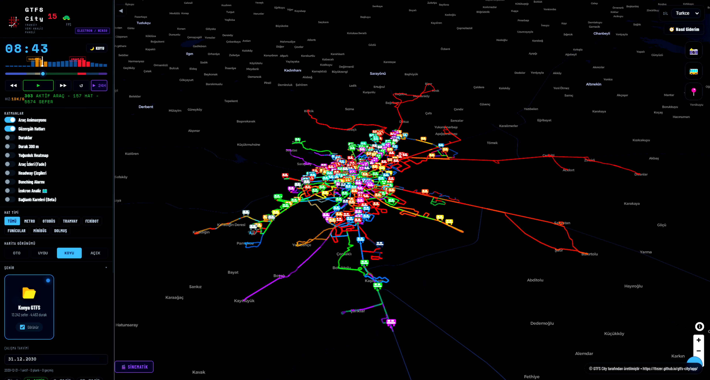
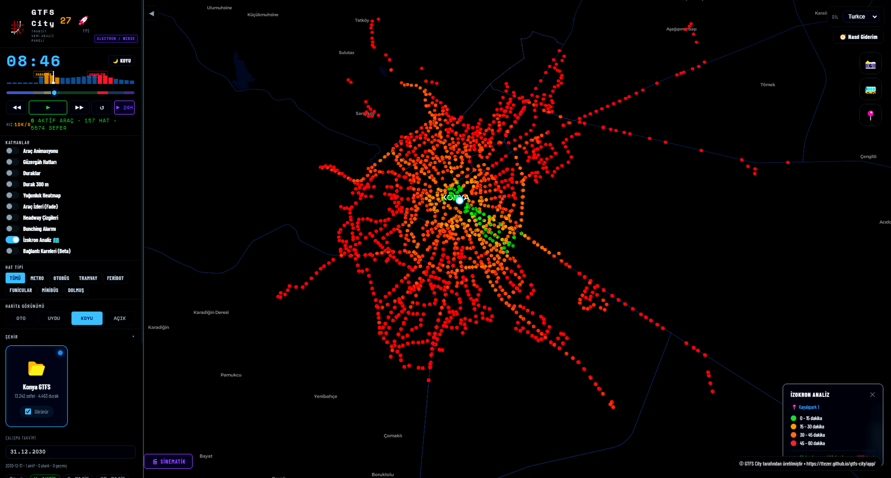
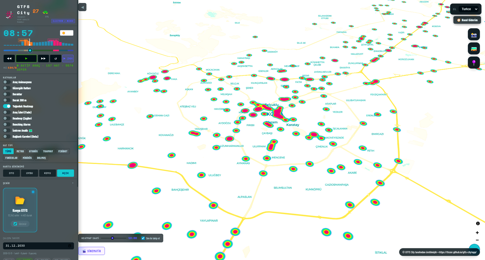

# GTFS City



Visualize and analyze your transit data on a map.  
**Free. Open source.**

---

## What Does It Do?

Upload your GTFS ZIP file — vehicles, routes, and stops come to life on the map.

- Watch trip simulations
- Find coverage gaps
- Spot operational issues

---

## Features

| | |
|---|---|
| 🎬 **Simulation** | Vehicles move on the map according to trip schedules |
| 🔵 **Isochrone Analysis** | See areas reachable within a specific time from a stop |
| 🟩 **Connectivity Grid** | Network accessibility score for each stop |
| 🔥 **Heatmap** | Stop and trip density as a heat map |
| 🚌 **Bunching Detection** | Vehicles bunching on the same route |
| 📍 **Route Planner** | Route suggestions based on actual trip times |

---

## Try It Now

👉 **[Web App](https://ttezer.github.io/gtfs-city/app/)** — no installation required

---

## Desktop Installation

```bash
git clone https://github.com/ttezer/gtfs-city.git
cd gtfs-city
npm install
npm start
```

---

## Screenshots

| Simulation | Isochrone |
|---|---|
|  |  |

| Connectivity Grid | Heatmap |
|---|---|
|  |  |

---

## Documentation

- [Architecture](docs/repo/mimari.md)
- [Roadmap](docs/repo/yol-haritasi.md)
- [Contributing](CONTRIBUTING.md)

---

## Contact

[Vatan](https://github.com/vatanaksoytezer)'s Dad **Tacettin TEZER**  
ttezer@gmail.com
