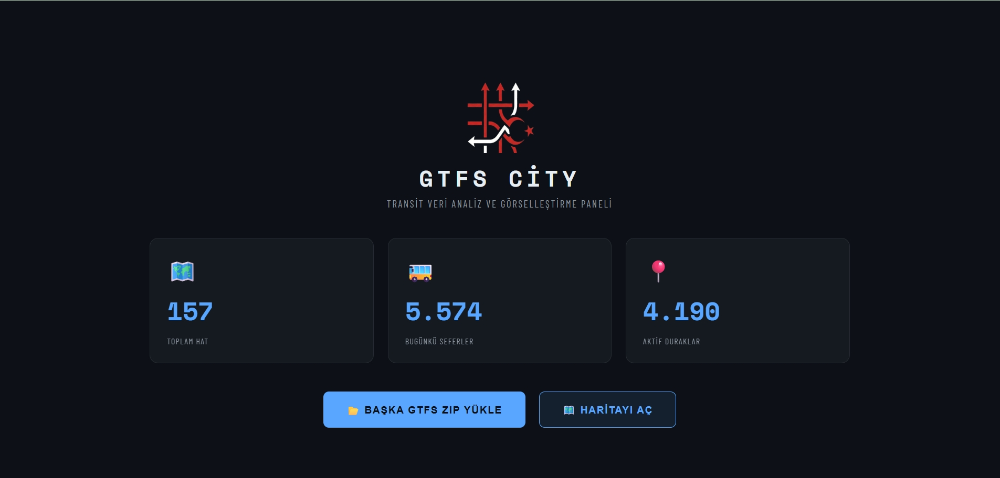
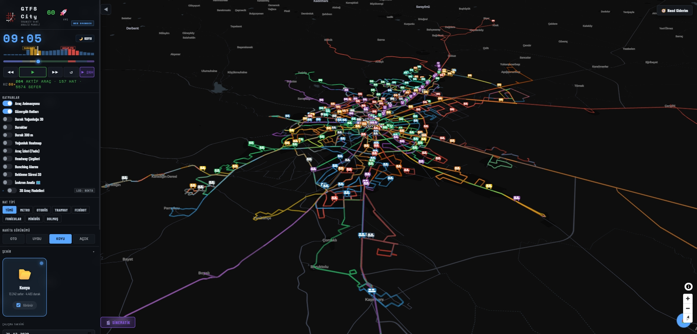
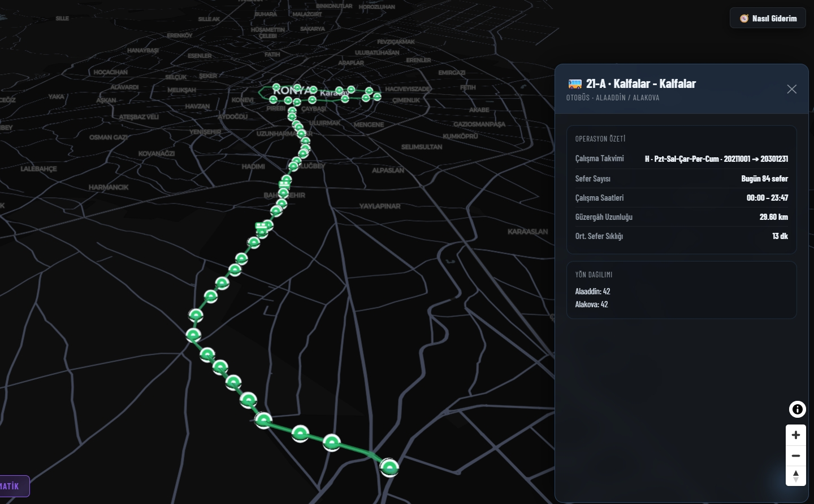
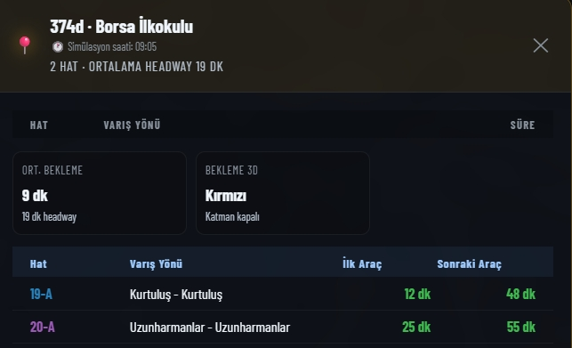
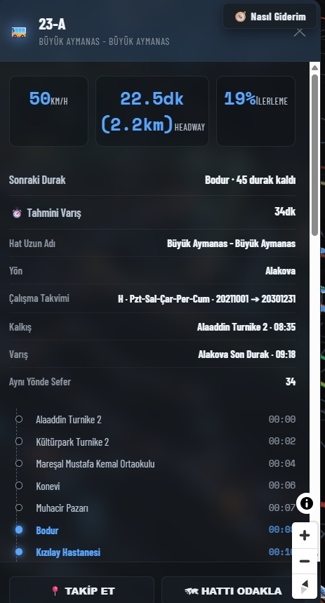
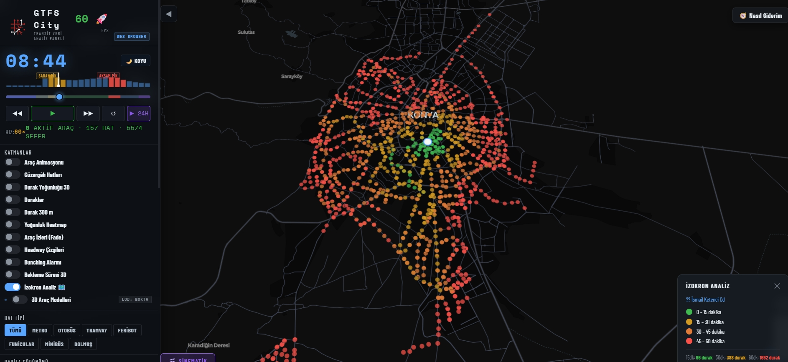

# GTFS City

GTFS City, GTFS ZIP verisini yükleyip toplu taşıma ağını incelemek için geliştirilen bir GTFS viewer ve analiz aracıdır. Masaüstünde tam Electron akışını, web tarafında ise ücretsiz demo deneyimini sunar.

English README: [README.en.md](./README.en.md)

## Öne Çıkanlar

- tek aktif GTFS veri seti
- upload-first başlangıç akışı
- hat, durak ve araç detay panelleri
- headway, bekleme, yoğunluk ve kapsama katmanları
- HTTPS GTFS ZIP linkinden yükleme (`Electron` içinde)

## Ekran Görüntüleri

### Giriş ekranı



### GTFS yükleme örneği



### Hat paneli



### Durak paneli



### Araç paneli



### İzokron analizi



## Çalışma Modeli

- Uygulama boş landing ekranla açılır.
- Kullanıcı GTFS ZIP yükler veya HTTPS ZIP linki verir.
- Veri hazır olunca `Haritayı Aç` ile çalışma ekranına geçilir.
- Aynı anda yalnızca tek yüklenmiş veri seti tutulur.

## Dil Seçeneği

- Uygulama varsayılan olarak Türkçe açılır.
- İngilizce kullanmak için landing ekranının sağ üstündeki dil seçiciden `English` seçin.
- Dil seçimi yerel olarak saklanır ve sonraki açılışlarda korunur.

## Kurulum

Gereksinimler:

- `Node.js`
- `npm`

Kurulum:

```bash
npm install
```

## Çalıştırma

Geliştirme:

```bash
npm start
```

Test:

```bash
npm test
```

Windows paketleme:

```bash
npm run build:win -- --dir
```

## Kullanım

1. Uygulamayı aç.
2. `GTFS ZIP Yükle` ile dosya seç veya Electron içinde HTTPS link kullan.
3. Yükleme tamamlanınca `Haritayı Aç` ile haritaya geç.
4. Sol menüden hat tipleri, görünürlük ve analiz katmanlarını yönet.
5. Hat, durak ve araç panellerini kullanarak veri incelemesi yap.

## Nereye Bakmalıyım?

- Hata raporu için: `Issues` üzerinde `bug` etiketiyle yeni kayıt açın.
- Bir fix arıyorsanız: önce `hata-listesi.md`, sonra `CHANGELOG.md` ve ilgili `Issues` kayıtlarını kontrol edin.
- Yeni özellik için: `Issues` üzerinde `feature` etiketiyle talep açın veya mevcut talepleri inceleyin.
- Öncelikler ve sonraki işler için: `isplani.md` ve `yol-haritasi.md` dosyalarına bakın.
- Katkı ve PR akışı için: `CONTRIBUTING.md` dosyasını izleyin.

## Ana Dosyalar

- `index.html` - arayüz iskeleti
- `script.js` - orkestrasyon ve ortak state
- `data-manager.js` - GTFS yükleme ve runtime apply
- `city-manager.js` - aktif veri seti kartı ve görünürlük akışı
- `service-manager.js` - çalışma takvimi ve servis filtresi
- `map-manager.js` - Deck.gl katmanları
- `ui-manager.js` - paneller ve kullanıcı etkileşimleri
- `simulation-engine.js` - simülasyon ve replay döngüsü
- `electron/main.js` / `electron/preload.js` - Electron köprüsü

## Dokümanlar

- `mimari.md` - teknik yapı
- `kontrol.md` - çalışma kuralları
- `isplani.md` - güncel durum ve sonraki işler
- `yol-haritasi.md` - orta ve uzun vadeli geliştirme başlıkları
- `hata-listesi.md` - açık hata ve veri doğruluk sorunları
- `desktop-web-notu.md` - platform sınırları
- `CHANGELOG.md` - kısa ürün kilometre taşları
- `CONTRIBUTING.md` - katkı akışı
- `docs/` - GitHub Pages vitrin dosyaları

## GitHub Pages

Statik vitrin sayfası `docs/` klasöründedir.

> Not: Ürün vitrini için Pages kullanılır; README tekrar eden kurulum talimatı dışında Pages içeriğini kopyalamaz.
