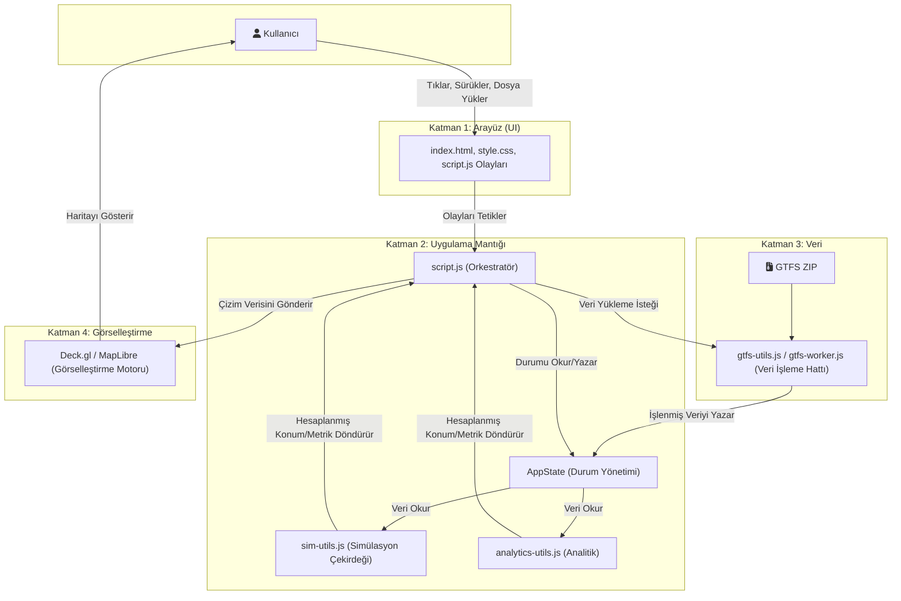

```mermaid
graph TD
    subgraph " "
        direction LR
        U[fa:fa-user Kullanıcı]
    end

    subgraph "Katman 1: Arayüz (UI)"
        UI[index.html, style.css, script.js Olayları]
    end

    subgraph "Katman 2: Uygulama Mantığı"
        Orchestrator["script.js (Orkestratör)"]
        State["AppState (Durum Yönetimi)"]
        Simulation["sim-utils.js (Simülasyon Çekirdeği)"]
        Analytics["analytics-utils.js (Analitik)"]
    end

    subgraph "Katman 3: Veri"
        DataPipeline["gtfs-utils.js / gtfs-worker.js (Veri İşleme Hattı)"]
        GTFS[fa:fa-file-archive GTFS ZIP]
    end

    subgraph "Katman 4: Görselleştirme"
        Renderer["Deck.gl / MapLibre (Görselleştirme Motoru)"]
    end

    U -- "Tıklar, Sürükler, Dosya Yükler" --> UI
    UI -- "Olayları Tetikler" --> Orchestrator
    Orchestrator -- "Veri Yükleme İsteği" --> DataPipeline
    GTFS --> DataPipeline
    DataPipeline -- "İşlenmiş Veriyi Yazar" --> State
    Orchestrator -- "Durumu Okur/Yazar" --> State
    State -- "Veri Okur" --> Simulation & Analytics
    Simulation & Analytics -- "Hesaplanmış Konum/Metrik Döndürür" --> Orchestrator
    Orchestrator -- "Çizim Verisini Gönderir" --> Renderer
    Renderer -- "Haritayı Gösterir" --> U
```