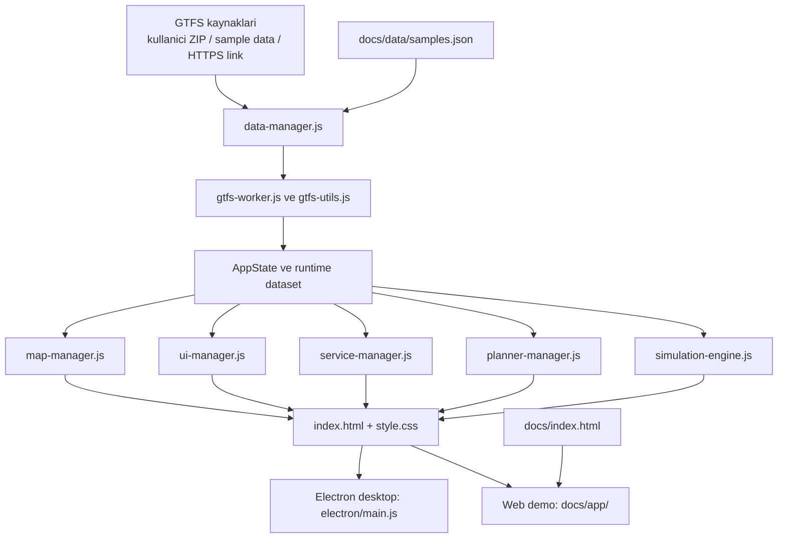

# Repo Akisi ve Temizlik Karari

Bu belge, deponun hangi dosyalardan olusmasi gerektigini, hangi alanlarin destek amacli oldugunu ve hangi klasorlerin fazlalik urettigini netlestirir.

## Tutulacak Ana Alanlar

### Uygulama cekirdegi

- `index.html`
- `style.css`
- `script.js`
- `config.js`
- `app-manager.js`
- `bootstrap-manager.js`
- `data-manager.js`
- `city-manager.js`
- `service-manager.js`
- `map-manager.js`
- `ui-manager.js`
- `planner-manager.js`
- `simulation-engine.js`
- `state-manager.js`
- `gtfs-utils.js`
- `gtfs-worker.js`
- `gtfs-validator.js`
- `gtfs-math-utils.js`
- `analytics-utils.js`
- `sim-utils.js`
- `render-utils.js`
- `ui-utils.js`
- `stop-connectivity-utils.js`
- `sw.js`

### Platform katmani

- `electron/main.js`
- `electron/preload.js`
- `assets/`

### Test ve otomasyon

- `test/`
- `scripts/`
- `package.json`
- `package-lock.json`
- `electron-builder.yml`

### Urun ve teknik dokumantasyon

- `README.md`
- `README.en.md`
- `mimari.md`
- `kontrol.md`
- `isplani.md`
- `yol-haritasi.md`
- `hata-listesi.md`
- `desktop-web-notu.md`
- `CHANGELOG.md`
- `CONTRIBUTING.md`
- `docs/`

## Destek Alanlari

### `docs/`

`docs/` iki farkli isi tasir:

1. GitHub Pages vitrini: `docs/index.html`, `docs/styles.css`, `docs/screens/`
2. Web demo yayini: `docs/app/`, `docs/data/`

Bu klasor aktif olarak kullanildigi icin kaldirilmamalidir. Ancak ayni kaynak kodun kokte ve `docs/app/` altinda iki kez tutulmasi mimari borctur.

### `Data/`

Masaustu surumde yerel GTFS ZIP denemeleri icin kullanilir. Runtime icin zorunlu degildir, fakat gelistirme ve demo akisi icin yararlidir.

## Kaldirilacak veya Repoda Tutulmayacak Alanlar

- `Ydek/`: gecici arsiv ve eski calisma kopyalari
- `dist/`: build ciktisi
- kokte biriken ekran goruntuleri: `giris_sayfasi.jpg`, `ornek_GTFS_Konya.jpg`, `hat_bilgi.jpg`, `durak_bilgi.jpg`, `arac_bilgi.jpg`, `durak_bazli_izokran.jpg`, `gtfscity.png`
- `docs/ekran-goruntusu.png`: bagli referansi olmayan eski goruntu
- `build-release.yml`: kokene konmus, GitHub Actions tarafindan calistirilmayan olu workflow dosyasi

## Repo Is Akisi

## Calisma Kurali

- Kok dizin urunun kaynagi olmali.
- `docs/app/` yayin hedefidir; elle fark acilmasi yerine kok kaynaklardan uretilmelidir.
- Build, test, dokuman ve yayin artefaktlari ayni seviyede durabilir; ancak gecici dosyalar ve yedek klasorleri repoda kalmamalidir.
- GitHub Pages yayini `.github/workflows/pages.yml` uzerinden yapilir; workflow `npm run prebuild` ile `docs/app` senkronunu otomatik uretir.
- Desktop paketleme `npm run prepare:desktop-data` ile `Data/` klasorunu hazirlar; yerel ZIP yoksa `docs/data/` altindaki izlenen ornek paketler fallback olarak kullanilir.

## Kalan Borc

Tamamen bitmeyen ana konu, `docs/app/` icin halen dosya kopyasi tabanli bir yayin stratejisi kullaniliyor olmasi.

Bir sonraki dogru seviye:

1. `docs/app/` icin sadece kopya degil, acik bir yayin pipeline'i tanimlamak
2. Web demoya ozel farklari donusum kurali olarak merkezilestirmek
3. Uzun vadede kok kaynaklardan dogrudan uretilen tek build akisina gecmek
