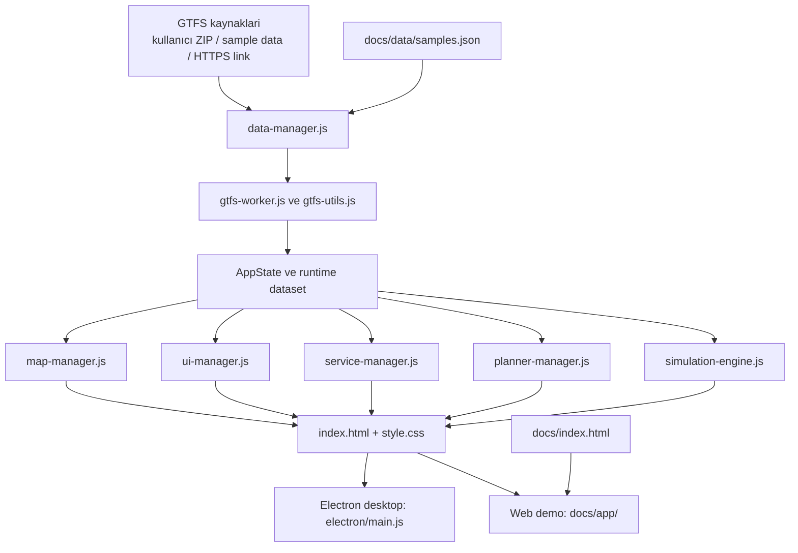

# Repo Akisi ve Temizlik Karari

Bu belge, deponun hangi dosyalardan olusmasi gerektigini, hangi alanlarin destek amacli oldugunu ve hangi klasorlerin fazlalik urettigini netlestirir.

## Tutulacak Ana Alanlar

### Uygulama cekirdegi

- `index.html`
- `style.css`
- `src/runtime/script.js`
- `src/core/config.js`
- `src/managers/app-manager.js`
- `src/core/bootstrap-manager.js`
- `src/managers/data-manager.js`
- `src/managers/city-manager.js`
- `src/managers/service-manager.js`
- `src/managers/map-manager.js`
- `src/managers/ui-manager.js`
- `src/managers/planner-manager.js`
- `src/runtime/simulation-engine.js`
- `src/runtime/bridge-utils.js`
- `src/runtime/i18n-runtime.js`
- `src/runtime/stop-coverage-controls.js`
- `src/runtime/heatmap-controls.js`
- `src/runtime/bunching-controls.js`
- `src/runtime/section-collapse-controls.js`
- `src/utils/gtfs-utils.js`
- `src/runtime/gtfs-worker.js`
- `src/utils/gtfs-validator.js`
- `src/utils/gtfs-math-utils.js`
- `src/utils/analytics-utils.js`
- `src/utils/sim-utils.js`
- `src/utils/render-utils.js`
- `src/utils/ui-utils.js`
- `src/utils/stop-connectivity-utils.js`
- `sw.js`

### Platform katmani

- `electron/main.js`
- `electron/preload.js`
- `assets/`

### Test ve otomasyon

- `test/`
- `scripts/`
- `package.json`
- `package-lock.json`
- `electron-builder.yml`

### Ürün ve teknik dokumantasyon

- `README.md`
- `README.en.md`
- `docs/repo/mimari.md`
- `docs/repo/kontrol.md`
- `docs/repo/isplani.md`
- `docs/repo/state-sahipligi.md`
- `docs/repo/yol-haritasi.md`
- `docs/repo/hata-listesi.md`
- `docs/repo/teknik-borc.md`
- `docs/repo/desktop-web-notu.md`
- `docs/repo/repo-akisi.md`
- `docs/repo/adr/`
- `CHANGELOG.md`
- `CONTRIBUTING.md`
- `docs/`

## Markdown Karar Tablosu

### Tutulacak ve aktif kullanilacak belgeler

| Dosya | Rol |
|---|---|
| `README.md` | repo girisi, calistirma ve yonlendirme |
| `README.en.md` | Ingilizce giris belgesi |
| `mimari.md` | teknik yapi, modul sinirlari ve mimari kurallar |
| `repo-akisi.md` | repo duzeni, build/sync/deploy akisi ve belge sahipligi |
| `kontrol.md` | resmi çalışma standardi ve kontrol sirasi |
| `hata-listesi.md` | açık bug ve veri dogrulugu kayitlari |
| `yol-haritasi.md` | orta ve uzun vadeli ürün yonu |
| `CHANGELOG.md` | kullaniciya gorunen onemli değişiklikler |
| `CONTRIBUTING.md` | katkı ve PR beklentileri |
| `THIRD_PARTY_NOTICES.md` | lisans ve ucuncu parti bildirimleri |
| `.github/pull_request_template.md` | PR açıklama standardi |
| `.github/ISSUE_TEMPLATE/*` | issue acma standardi |
| `adr/*` | kalici mimari karar kayitlari |

### Tutulacak ama dar kapsamli olacak belgeler

| Dosya | Kural |
|---|---|
| `desktop-web-notu.md` | yalnızca platform farklari tutulur; mimari tekrar yazilmaz |
| `adr/*` | sadece karar niteligindeki degisikliklerde yeni dosya acilir |

### Nihai karar verilen plan belgeleri

| Dosya | Karar |
|---|---|
| `isplani.md` | tek aktif planning ve güncel durum kaynagi olarak tutulur |
| `docs/is-plani.md` | kaldirilir; ayri planning kaynagi tutulmaz |

Bu tabloda yer almayan yeni bir `.md` dosyasi acilmadan önce su soru sorulmalidir:

`Bu bilgi mevcut belgelerden hangisinin konusu?`

Açık bir cevap yoksa yeni belge acilmaz.

## Metin Standardi

- Repo dokumanlarinda varsayilan yazi stili UTF-8 Turkce olmalidir.
- Turkce ana belgelerde ASCII'ye zoraki donusum yapilmaz.
- Ayni kavram farkli dosyalarda farkli adla tekrar yazilmaz.

## Destek Alanlari

### `docs/`

`docs/` iki farkli isi tasir:

1. GitHub Pages vitrini: `docs/index.html`, `docs/styles.css`, `docs/screens/`
2. Web demo yayini: `docs/app/`, `docs/data/`

Bu klasor aktif olarak kullanildigi icin kaldirilmamalidir. Ancak ayni kaynak kodun kokte ve `docs/app/` altinda iki kez tutulmasi mimari borctur.

### `Data/`

Masaustu surumde yerel GTFS ZIP denemeleri icin kullanilir. Runtime icin zorunlu degildir, fakat gelistirme ve demo akisi icin yararlidir.

## Kaldirilacak veya Repoda Tutulmayacak Alanlar

- `Ydek/`: gecici arsiv ve eski çalışma kopyalari
- `dist/`: build ciktisi
- kokte biriken ekran goruntuleri: `giris_sayfasi.jpg`, `ornek_GTFS_Konya.jpg`, `hat_bilgi.jpg`, `durak_bilgi.jpg`, `arac_bilgi.jpg`, `durak_bazli_izokran.jpg`, `gtfscity.png`
- `docs/ekran-goruntusu.png`: bagli referansi olmayan eski goruntu
- `build-release.yml`: kokene konmus, GitHub Actions tarafindan calistirilmayan olu workflow dosyasi

## Repo Is Akisi

## Çalışma Kurali

- Kok dizin urunun kaynagi olmali.
- `docs/app/` yayin hedefidir; elle fark acilmasi yerine kok kaynaklardan uretilmelidir.
- Build, test, dokuman ve yayin artefaktlari ayni seviyede durabilir; ancak gecici dosyalar ve yedek klasorleri repoda kalmamalidir.
- GitHub Pages yayini `.github/workflows/pages.yml` uzerinden yapilir; workflow `npm run prebuild` ile `docs/app` senkronunu otomatik uretir.
- Desktop paketleme `npm run prepare:desktop-data` ile `Data/` klasorunu hazirlar; yerel ZIP yoksa `docs/data/` altindaki izlenen örnek paketler fallback olarak kullanilir.

## Belge Sahipligi

Her konu icin tek bir ana belge olmali:

- ürün girisi ve kullanim: `README.md`
- teknik kurallar ve modul sinirlari: `mimari.md`
- repo yapisi ve yayin akisi: `repo-akisi.md`
- is yapma sirasi ve kontrol adimlari: `kontrol.md`
- bug kayitlari: `hata-listesi.md`
- feature ve orta/uzun vade: `yol-haritasi.md`
- yayinlanmis sonuç ozeti: `CHANGELOG.md`
- kalici mimari kararlar: `adr/*`

Gecici notlar, tur loglari veya ayni konuyu ikinci kez anlatan yan belgeler biriktirilmemelidir.

## Kalan Borc

Tamamen bitmeyen ana konu, `docs/app/` icin halen dosya kopyasi tabanli bir yayin stratejisi kullaniliyor olmasi.

Bir sonraki doğru seviye:

1. `docs/app/` icin sadece kopya degil, açık bir yayin pipeline'i tanimlamak
2. Web demoya ozel farklari donusum kurali olarak merkezilestirmek
3. Uzun vadede kok kaynaklardan dogrudan uretilen tek build akisina gecmek
